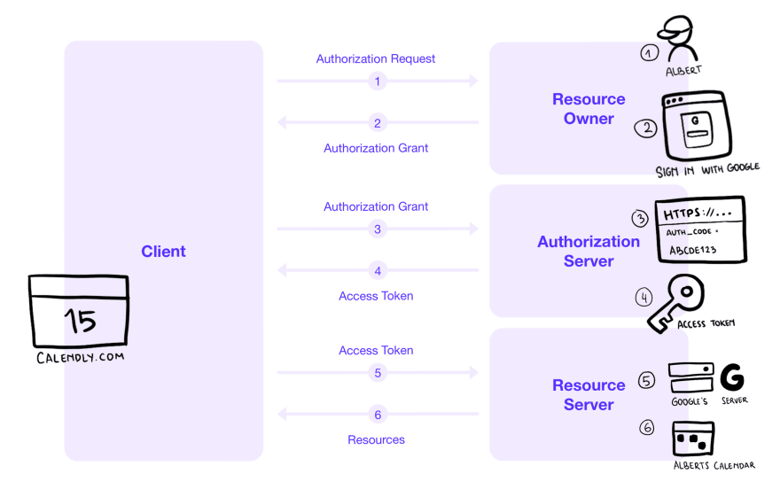

# Oauth

OAuth 2.0 is an authorization framework that defines how a third-party application can obtain access to a service securely without requiring security details (username, password, etc.) from the user. A common example of OAuth 2.0 is when you use "Sign in with Google" to log in to other websites.  

Here you are an example authentication flow with Oauth:  
  

### `Sign in with Google` as an example

1. Service wants to access User's Google Calendar. Service redirects User to sign in to his Google account where he grants Calendar permission for Service
1. Google returns an `Authorization Grant` and redirects User to Service.
1. Service gives the `Authorization Grant` to Google and
1. receives an `Access Token`
1. Service can now use this `Access Token`
1. Service can access User's Google Calendar, but not his Google Drive or other resources

### Tokens
There are two kinds: `Access Token` and `Refresh Token`. The access tokens tend to be **short lived**, the the refreshed token is used once the access token has expired in order to retrieve a new access token.

#### Access Token

